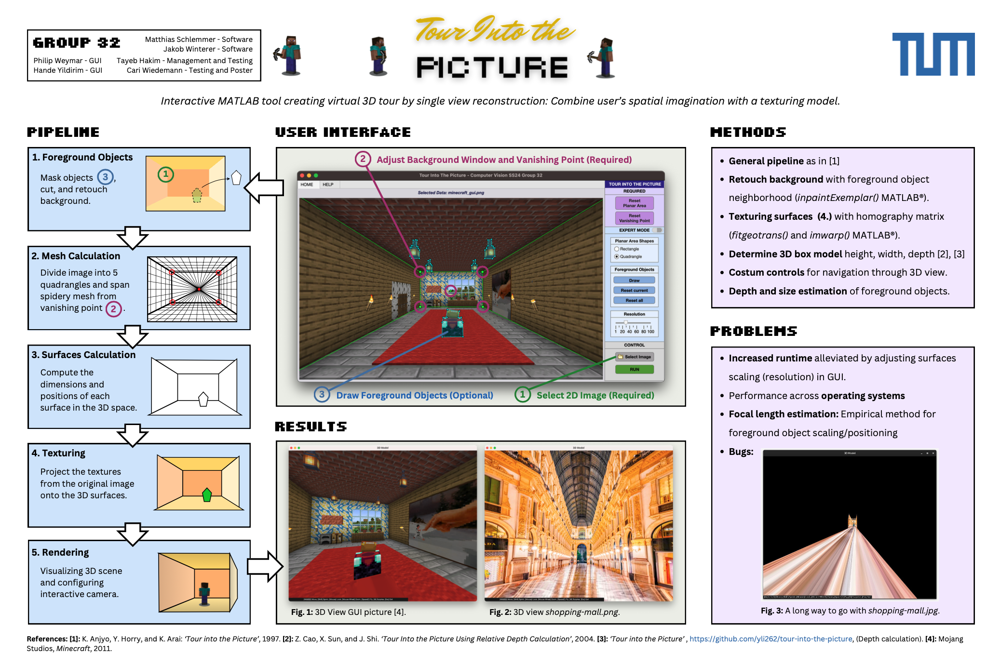

# Computer Vision Group 32

[](Material/Group_32_Poster.pdf)

## Requirements

- MATLAB version 2024a
- Toolboxes: Image Processing Toolbox

## Instructions

- Open and run main.m to open the GUI. 
- If you have any problems, you can click through the pages in the HELP tab to find an answer to your question or problem.
- Choose your desired image with 'Select image'.
- In the GUI the rectangle and vanishing point are already loaded. You can drag them to the desired positions, 
  or reset them and draw them anew:
  Click on 'Reset' to delete the vanishing point or the planar figure. The Button will turn into 'Draw'. 
  Click on it again to draw and drag the rectangle/vanishing point.

Expert Mode: Specify advanced settings

- Change the Planar Shape to Quadrangle to move the edges of the Planar Area freely.
- Choose Foreground objects to be removed from the background image:
  Click on 'Draw' in the Foreground Objects section and define your polygon in the image. You can add multiple objects. To delete
  the most recent added polygon, press 'Reset current'. To delete all polygons, select 'Reset all'.
- Change the resolution of the 3D scene with the slider, e.g. decrease it if your machine doesn't have much RAM.

- Click on 'Run' to start the 3D model.
- In the 3D model, move the cursor to look around. Controls for moving around are explained at the bottom left. 
- When you've gotten comfortable with using the application, press 'm' while in the 3D room for a little surprise! ;)
- Press 'Esc' on your keyboard to leave the simulation. Now you can adjust your settings in the GUI window 
  and start the model again.

IMPORTANT for MacOS users:
When starting the simulation for the first time, you will be asked to allow matlab to control the mouse. 
Please accept these changes. They are needed for the camera controls of the Simulation.

Have fun!

### Cloning the Repository

**Clone the repository**:
   ```sh
   git clone https://gitlab.lrz.de/computer-vision1/computer-vision-ss24.git
   cd computer-vision-ss24
   ```
